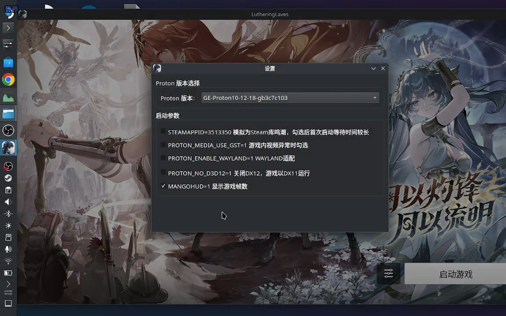
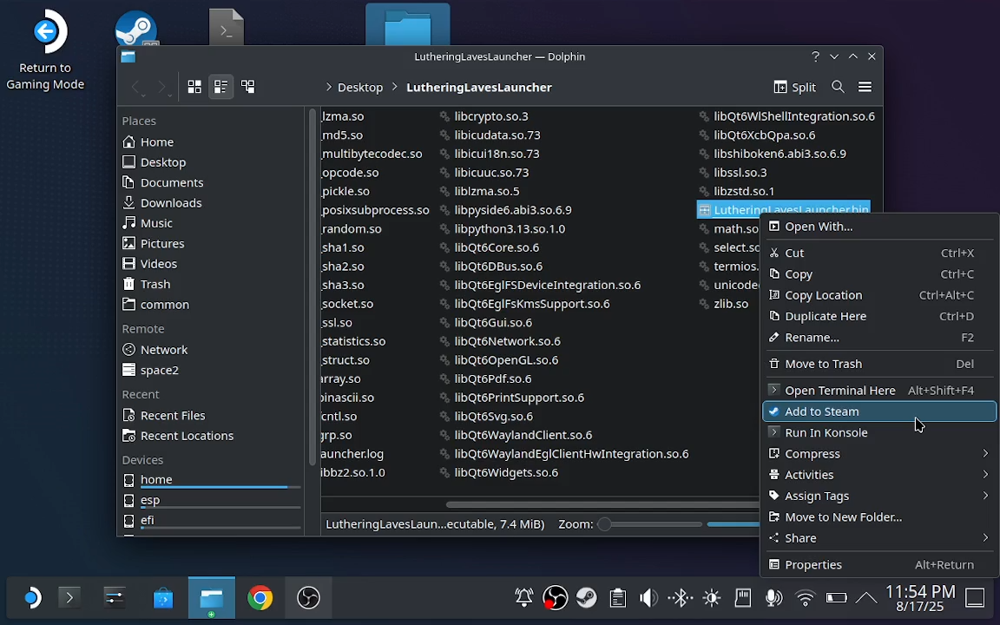

# LutheringLaves 介绍
鸣潮第三方启动器，方便在SteamDeck下载鸣潮国服客户端，Linux其他发行版同样适用。目前有UI版和命令行版本，可自行选择。




镜像仓库：https://gitee.com/tiz/LutheringLaves

# UI版本使用

#### 启动器安装
1.steamdeck切换至桌面模式，下载项目release文件，解压后将`LutheringLavesLauncher/`目录下的`LutheringLavesLauncher.bin`右键添加到steam库里


2.切换回掌机模式就能直接使用启动器下载、更新、运行游戏了，掌机模式下的运行效果如下图


#### 下载目录
目前游戏下载目录默认为 `LutheringLavesLauncher/` 目录下的 `Wuthering Waves Game` 目录，暂不支持自定义目录

#### 运行环境
启动器会自动检测`~/.local/share/Steam/compatibilitytools.d/`和`~/.local/share/Steam/steamapps/common/`目录下的所有可用 GE-Proton 和 Proton，优先使用最新版本的GE-Proton，如果没有GE-Proton，则使用Proton。


# 命令版本使用
#### 初次下载游戏
1.运行以下命令后，会在当前目录下载'LutheringLaves.py'文件并创建'Wuthering Waves Game'文件夹，游戏文件会保存在'Wuthering Waves Game'文件夹下。
``` bash
curl -sL https://raw.githubusercontent.com/last-live/LutheringLaves/main/src/LutheringLaves.py -o LutheringLaves.py && python3 LutheringLaves.py
```

国内镜像仓库命令，网络不好用这个
``` bash
curl -sL https://gitee.com/tiz/LutheringLaves/raw/main/src/LutheringLaves.py -o LutheringLaves.py && python3 LutheringLaves.py
```

2.下载完成后，将游戏客户端文件将"Wuthering Waves.exe"添加到steam库里。

3.steam中找到该游戏，游戏属性里打开"强制使用特定 Steam Play 兼容工具"，选择一个Porton，建议是使用最新版本的GE-Proton。

#### 更新游戏
更新游戏时，需要设定工作模式 --mode 为 update，请确保当前目录下有"Wuthering Waves.exe"文件，如需指定其它目录，可以指定参数 --folder
``` bash
curl -sL https://raw.githubusercontent.com/last-live/LutheringLaves/main/src/LutheringLaves.py -o LutheringLaves.py && python3 LutheringLaves.py --mode update
```

国内镜像仓库命令，网络不好用这个
``` bash
curl -sL https://gitee.com/tiz/LutheringLaves/raw/main/src/LutheringLaves.py -o LutheringLaves.py && python3 LutheringLaves.py --mode update
```

#### 设置下载目录
设置启动参数--folder，可以指定下载目录，目前只支持相对路径，默认目录是'Wuthering Waves Game'
``` bash
python3 LutheringLaves.py --mode install --folder gamefolder
```

### 增量更新
设置启动参数--mode为patch-update，可以使用增量更新下载，功能尚未完全测试通过，请谨慎使用。使用增量更新时，需要游戏目录下有launcherDownloadConfig.json文件且本地版本大于等于2.4.0。增量更新过程中，会产生临时文件，需要硬盘预留额外的空间，当前版本预计额外预留60g。
``` bash
python3 LutheringLaves.py --mode patch-update
```

### 项目打包

```
# 项目克隆
git clone https://github.com/last-live/LutheringLaves.git

# 进入项目目录
cd LutheringLaves

# nuitka打包环境构建
docker build -t lastlive/nuitka-patchelf:latest .

# 在容器内打包
docker run -it --rm -v ${PWD}:/home/nuitka/Lutheringlaves -w /home/nuitka/Lutheringlaves lastlive/nuitka-patchelf:latest \
        nuitka --standalone --python-flag="-S" --follow-imports \
        --windows-console-mode="disable"  --windows-icon-from-ico="resource/launcher.ico" \
        --main="LutheringLavesLauncher.py"  --enable-plugins="pyside6"  --linux-icon="resource/launcher.ico" \
        --include-raw-dir=tools=tools   --include-raw-dir=Font=Font   --include-raw-dir=resource=resource
```